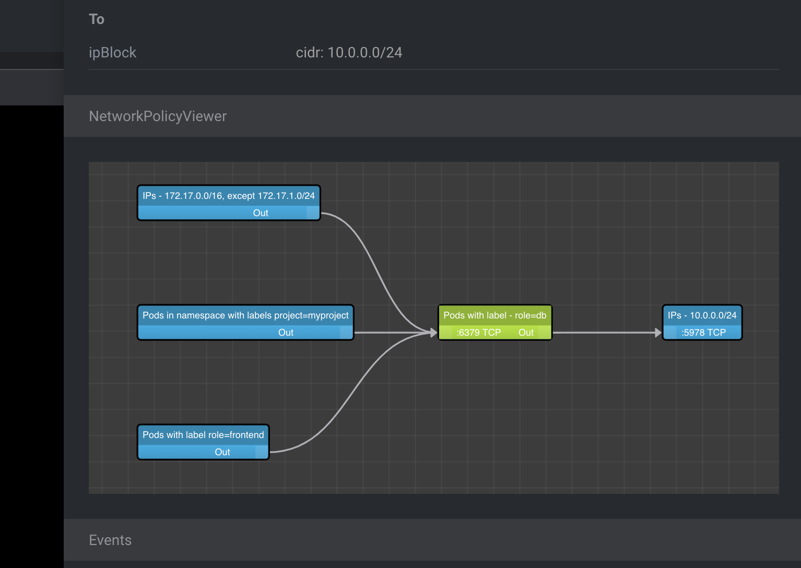

# lens-extension-network-policy-viewer

View your Kubernetes NetworkPolicy manifests as graph in Lens IDE

## Installation

### Direct link to Lens

[lens://app/extensions/install/lens-extension-network-policy-viewer](lens://app/extensions/install/lens-extension-network-policy-viewer)

### Manual installation

Menu > Extensions and search for `lens-extension-network-policy-viewer`.

### Alternatives downloads

#### Github
https://github.com/artturik/lens-extension-network-policy-viewer/releases/latest/download/lens-certificate-info.tgz

#### NPM

https://registry.npmjs.org/lens-extension-network-policy-viewer/-/lens-extension-network-policy-viewer-$VERSION.tgz

Replace `$VERSION` with a real version like `0.0.1`.

## Credits

* [React Flow](https://github.com/wbkd/react-flow)
* [NetworkPolicyViewer](https://github.com/artturik/network-policy-viewer)
* [lens-extension-certificate-info](https://github.com/jkroepke/lens-extension-certificate-info)
