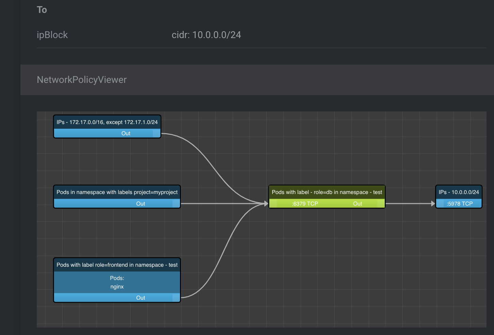

# lens-extension-network-policy-viewer

View your Kubernetes NetworkPolicy manifests as graph in Lens IDE

[Demo: NetworkPolicyViewer as standalone app](https://artturik.github.io/network-policy-viewer/)

*NEW VERSION 3.0.0* - Will show pods that match NetworkPolicy

## Installation

### Direct link to Lens

[lens://app/extensions/install/lens-extension-network-policy-viewer](lens://app/extensions/install/lens-extension-network-policy-viewer)

### Manual installation (Lens 6.x+)

Menu > Extensions and search for `lens-extension-network-policy-viewer`.

### For Lens 5.x

Use [1.0.0](https://github.com/artturik/lens-extension-network-policy-viewer/archive/refs/tags/1.0.0.tar.gz) version

### Alternative downloads

#### Github
https://github.com/artturik/lens-extension-network-policy-viewer/archive/refs/heads/main.tar.gz

#### NPM

https://registry.npmjs.org/lens-extension-network-policy-viewer/-/lens-extension-network-policy-viewer-$VERSION.tgz

Replace `$VERSION` with a real version like `3.0.0`.

## Credits

* [React Flow](https://github.com/wbkd/react-flow)
* [NetworkPolicyViewer](https://github.com/artturik/network-policy-viewer)
* [lens-extension-certificate-info](https://github.com/jkroepke/lens-extension-certificate-info)
